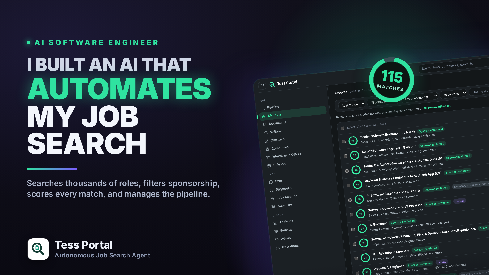
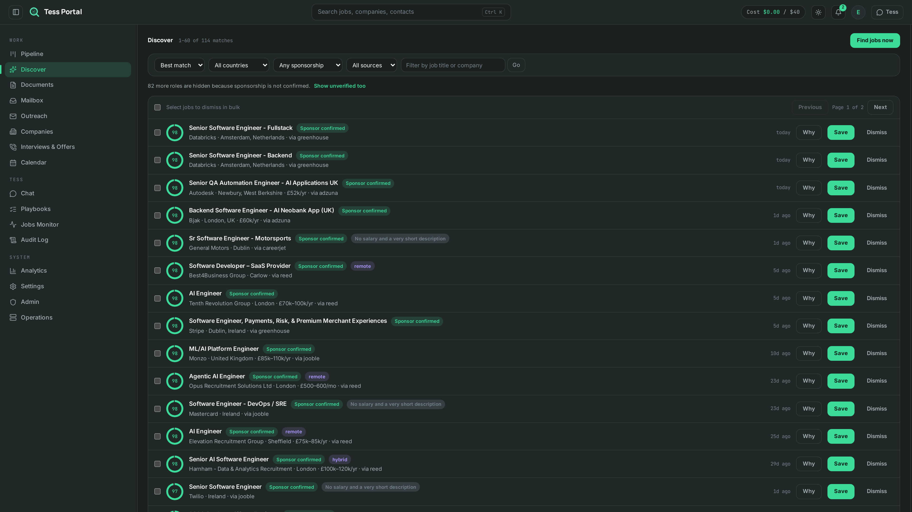
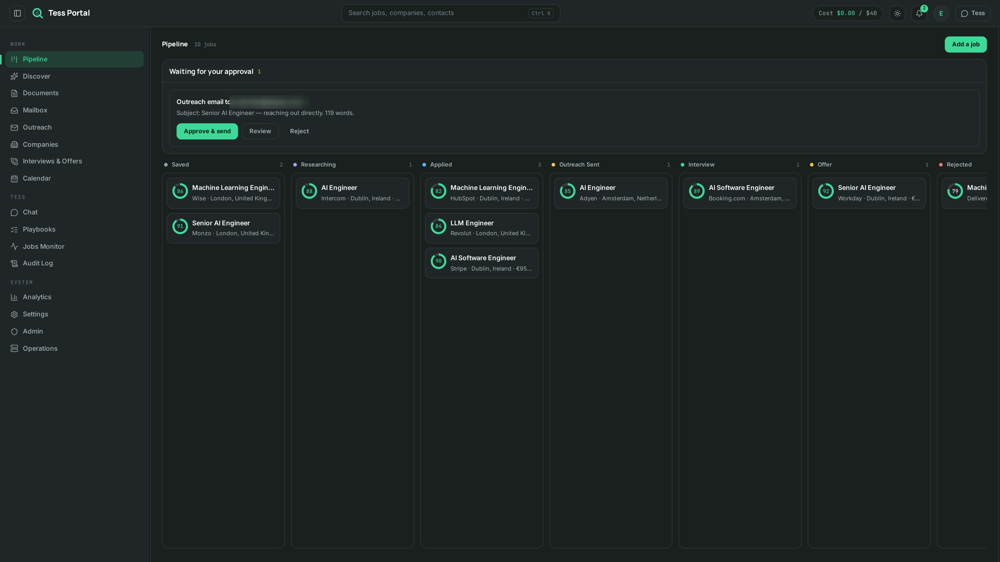
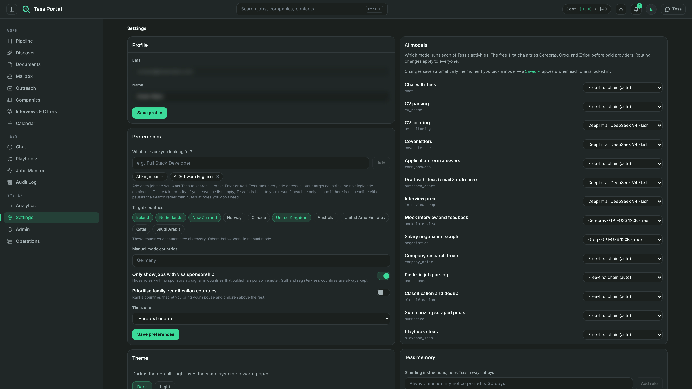
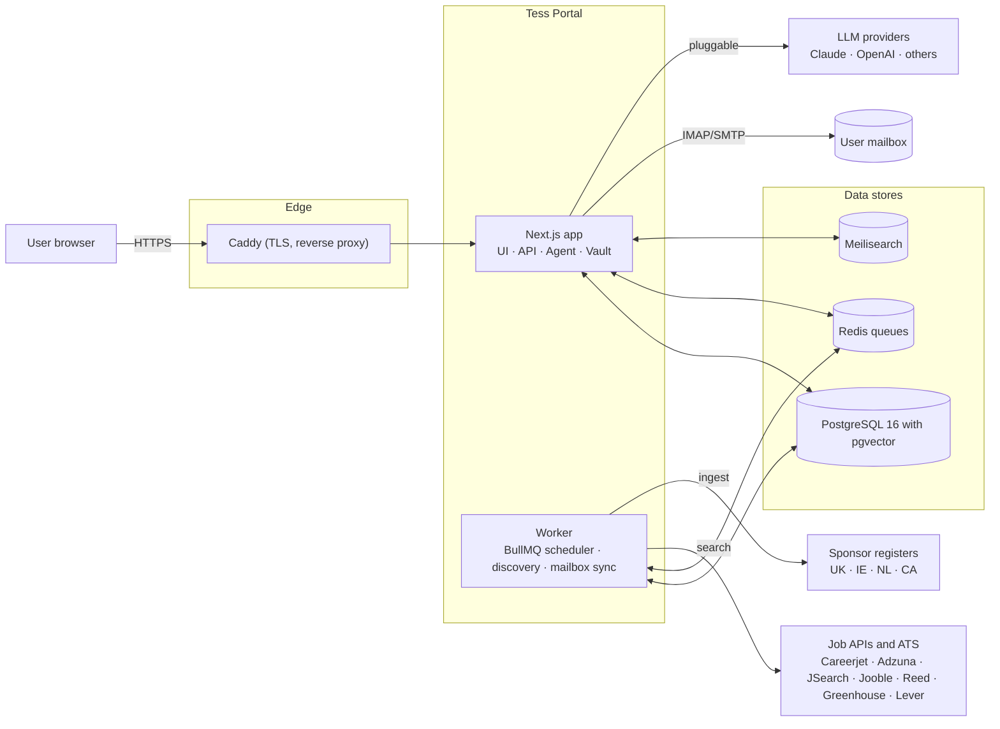

# Tess Portal

**An agentic job-search platform where an AI agent (Tess) runs an international
job hunt end to end — discovering roles, verifying visa sponsorship against
official government registers, tailoring applications, handling outreach and a
built-in mailbox, preparing for interviews, and coaching salary negotiation —
all under a human-approval gate on every outbound action.**

Built solo, from empty repo to a live, invite-only production deployment, in TypeScript/Next.js on a self-managed VPS.

> 📌 **This is a public portfolio snapshot for you to review.**
> Secrets, environment files, backups, and internal operational documents are
> excluded — this repo is source-for-review, not a turnkey deploy. See
> `.env.example` for the shape of the required configuration.

---

## What it is

Most job-search tools help you *find* postings. The hard problems start after
that: is this role actually relevant, does the salary work, and — for anyone
job-hunting across borders — **can this employer even sponsor a work visa?** You
usually find that last one out weeks in, after the interviews.

Tess Portal solves that. An AI agent ("Tess", powered by Claude with pluggable
alternatives) searches many sources every night, filters ruthlessly for
relevance, and verifies visa sponsorship against official government registers
before a job is ever shown. From there she drafts tailored applications, manages
outreach through an embedded mailbox, researches companies, prepares interview
answers grounded in the user's real experience, and coaches salary negotiation
from real market data — never sending anything without explicit human approval.

It is the kind of system that is easy to demo and hard to build correctly: real
job APIs, real employer data, a real embedded email client, and an LLM in the
loop that must never fabricate a fact or act without the user's consent.

## Demo video

<a href="https://ememndon.com/videos/tess_portal.mp4">
  
</a>

*Click the image above to watch the full walkthrough.*

## Screenshots

> Captured from a live instance. Personal details have been redacted.

**Discover:** scored jobs filtered for relevance, with confirmed visa-sponsor badges, salaries in the employer's own currency, and the gate that hides roles it cannot verify.



**Pipeline:** the application board from Saved through to Offer, with an outbound email waiting in the approval queue at the top.



**Settings:** target roles and countries, the "only show visa sponsorship" switch, and the choice of which AI model runs each task (free providers are tried first, paid ones only as a fallback).



## Feature surface

**Discovery engine**
- Searches five job APIs (Careerjet, Adzuna, JSearch, Jooble, Reed) and seven
  applicant-tracking systems (Greenhouse, Lever, Ashby, Workable, SmartRecruiters,
  Recruitee, Teamtailor) across five countries
- Two-stage relevance filter: a deterministic title gate + an embedding-similarity
  rescue (pgvector), so twenty right jobs beat two hundred wrong ones
- A geo-sanity layer that stops a country-blind provider from mislabelling jobs
- Runs on a deterministic nightly schedule, independent of the LLM

**Visa-sponsorship verification**
- Matches every job's employer against official licensed-sponsor registers
  (UK, Ireland, Netherlands, Canada) — ingested and refreshed automatically
- Unverifiable roles in register countries are hidden by default; confirmed
  sponsors are badged; nothing is guessed
- Salaries shown in the employer's own currency, never silently converted

**Applications & pipeline**
- Drag-and-drop pipeline board (Saved → Applied → Interview → Offer)
- CV and cover-letter tailoring drawn from the user's real CV, per posting
- Company research briefs that cite their sources — no source, no claim

**Embedded mailbox & outreach**
- Full IMAP/SMTP email client: threading, rich compose, undo/scheduled send,
  drafts autosave, filing rules, search operators, snooze
- AI-drafted replies ("Draft with Tess") — suggested, never auto-sent
- Approval-gated cold-outreach sequences with per-contact research

**Interview & offer**
- Interview prep packs generated when an interview is scheduled: likely questions
  mapped only to the user's real projects and STAR stories — never fabricated
- Negotiation coach anchored on real observed salary data, reported in the
  market's own currency, honest about small sample sizes

**Security & operation**
- Human-in-the-loop: every outbound action is queued for explicit approval
- Encrypted secrets vault (AES-256-GCM, server-only decrypt) for third-party keys —
  never exposes raw values to the client or logs
- Invite-only access with a shared front-door gate and per-user login
- Full audit log; nightly GPG-encrypted offsite backups; logger with secret redaction

## Architecture



The web app serves the UI and API and runs the agent; a separate worker process
owns everything slow or scheduled — the nightly discovery firehose, sponsor-register
ingestion, mailbox sync, and reminders — so heavy background work never blocks the
request path. Discovery, sponsorship resolution, and relevance scoring are
deterministic and keep running even when the LLM is unavailable. Nothing is
reachable from the internet except through the Caddy reverse proxy.

## Tech stack

| Layer | Choice |
|---|---|
| Framework | Next.js 16 (App Router, TypeScript) + React 19 |
| Database | PostgreSQL 16 + pgvector, Drizzle ORM |
| Queues / jobs | Redis + BullMQ |
| Search | Meilisearch |
| Agent / LLM | Anthropic SDK (Claude), cost-aware routing, pluggable providers |
| Embeddings | pgvector similarity for relevance + dedup |
| Mail | IMAP/SMTP embedded client (imapflow · mailparser · nodemailer) |
| UI | Tailwind CSS |
| Auth | session-based, hashed passwords, invite + gate + per-user login |
| Secrets | AES-256-GCM vault, server-only decrypt, live "test connection" probes |
| Infra | Docker Compose, Caddy (reverse proxy + auto-TLS), Linux VPS |
| Tests | Vitest (web + worker), Playwright config |

## Project structure

```
apps/
  web/                 Next.js application (UI + API + agent)
    app/(portal)/      Page routes: discover, pipeline, mailbox, chat, companies,
                        interviews, outreach, analytics, calendar, documents,
                        playbooks, admin, settings, audit-log, ...
    app/api/           62 route handlers (REST + SSE + internal)
    lib/               agent tools, server DAL, secrets vault, mail, intel (salary,
                        interview prep, company briefs, recommendations)
    tests/             web test suites (Vitest)
  worker/              Background worker process
    src/discovery/     the discovery firehose: provider + ATS adapters, relevance
                        gate, sponsor-register ingestion, scoring, dedup, geo checks
    src/mailbox/       IMAP/SMTP sync
    src/scheduler.ts   BullMQ scheduled tasks (nightly discovery, ingestion, ...)
    tests/             worker test suites (Vitest)
packages/
  db/                  Drizzle schema (65 tables), 19 SQL migrations, clients
  shared/              pino logger with secret redaction, shared helpers
docker-compose.yml     Full service topology (web, worker, db, redis, search)
scripts/               Ops: env generation, backups, offsite sync, test runner
```

## Running it

This snapshot excludes secrets and infra config, so it will not deploy as-is —
but the shape is:

```bash
./scripts/generate-env.sh    # generates .env with fresh secrets (never committed)
docker compose build
docker compose up -d          # starts web, worker, db, redis, search
bash scripts/run-tests.sh     # web + worker test suites
```

`.env.example` documents every required variable. Third-party API keys (LLM
providers, job APIs, mail) are entered at runtime through the in-app encrypted
Secrets Vault — nothing is hardcoded or required at build time beyond the core
platform variables.

## License

Proprietary — all rights reserved. Shared publicly for review purposes only
(portfolio, hiring, technical due diligence). Not licensed for reuse,
redistribution, or deployment. See [LICENSE](LICENSE).

---

*Built by Emem Ndon.*
